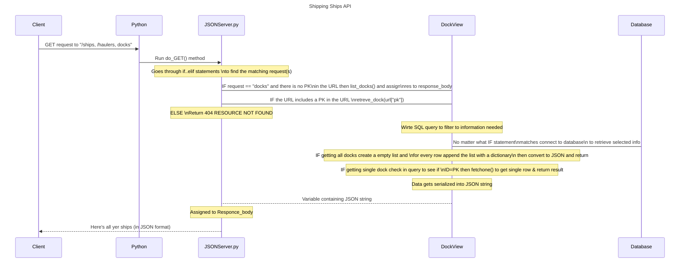

```mermaid
sequenceDiagram
title Shipping Ships API

participant Client
participant Python

participant JSONServer.py
participant DockView

participant Database
Client->>Python:GET request to "/ships, /haulers, docks"

Python->>JSONServer.py:Run do_GET() method
note over JSONServer.py: Goes through if..elif statements \nto find the matching request(s)

JSONServer.py -> DockView : IF request == "docks" and there is no PK\nin the URL then list_docks() and assign\nres to response_body

JSONServer.py -> DockView :IF the URL includes a PK in the URL \nretreve_dock(url["pk"]) 

note over JSONServer.py:ELSE \nReturn 404 RESOURCE NOT FOUND
note over DockView:Wirte SQL query to filter to information needed

DockView -> Database: No matter what IF statement\nmatches connect to database\n to retrieve selected info


note over DockView:IF getting all docks create a empty list and \nfor every row append the list with a dictionary\n then convert to JSON and return 

note over DockView:IF getting single dock check in query to see if \nID=PK then fetchone() to get single row & return result 

note over DockView:Data gets serialized into JSON string 
DockView --> JSONServer.py: Variable containing JSON string 

note over JSONServer.py: Assigned to Responce_body

JSONServer.py-->>Client: Here's all yer ships (in JSON format)

```